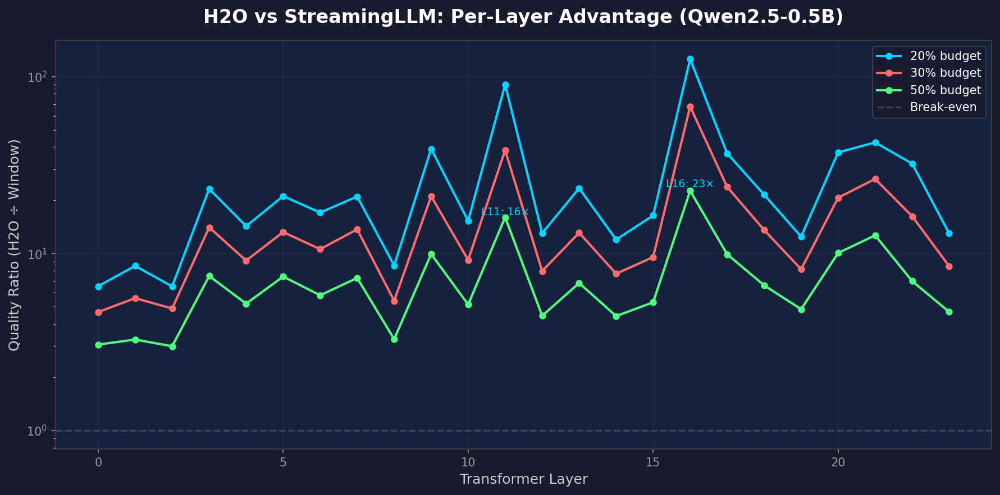
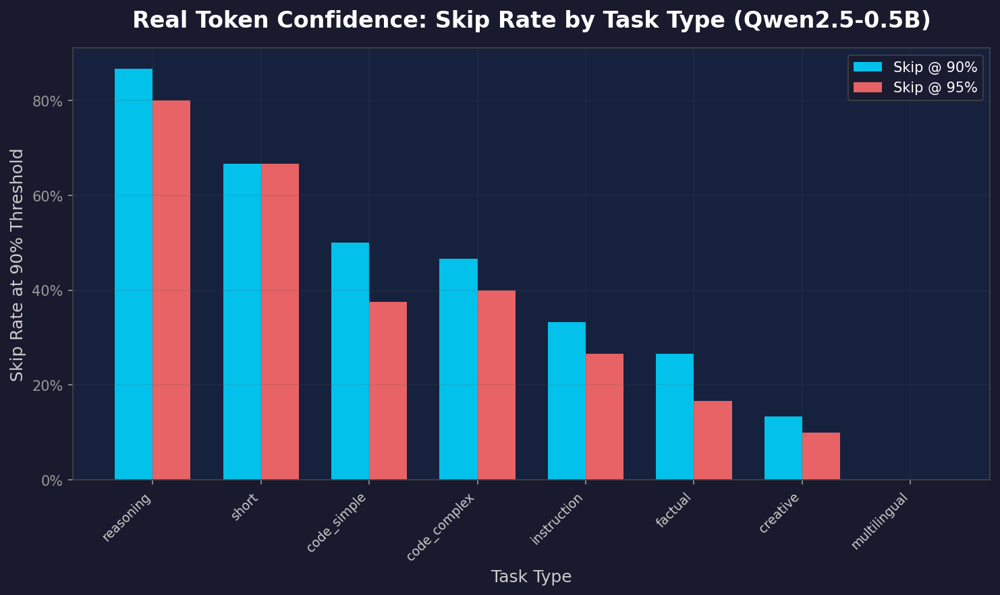
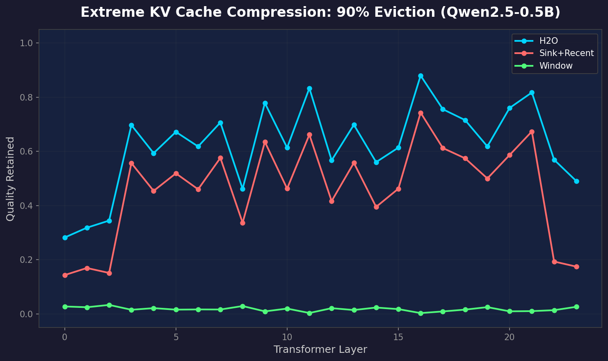
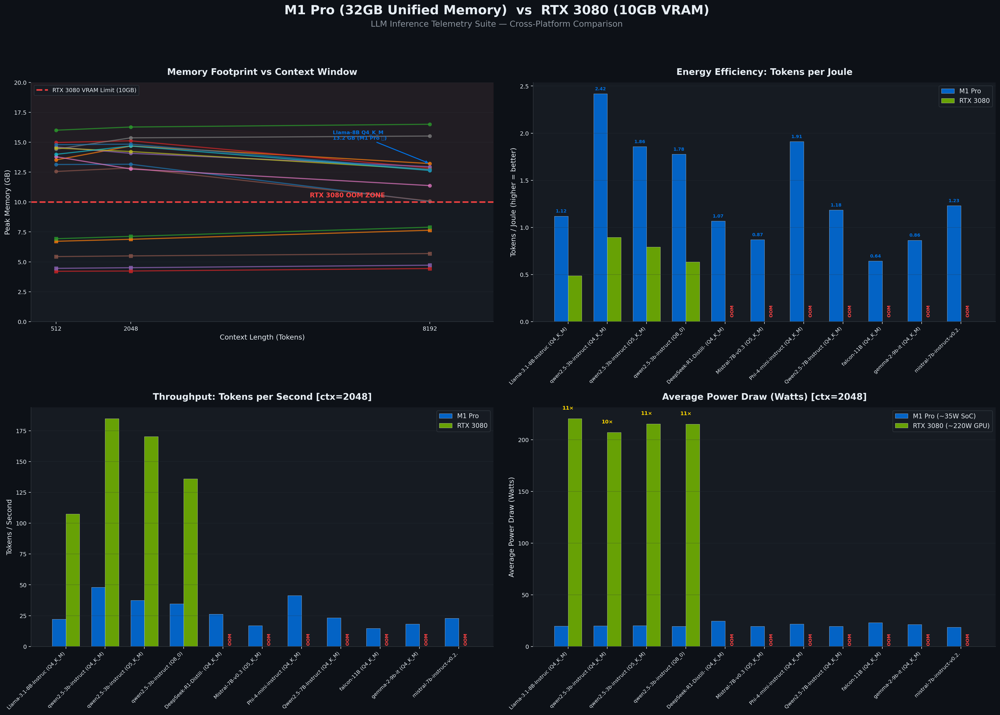
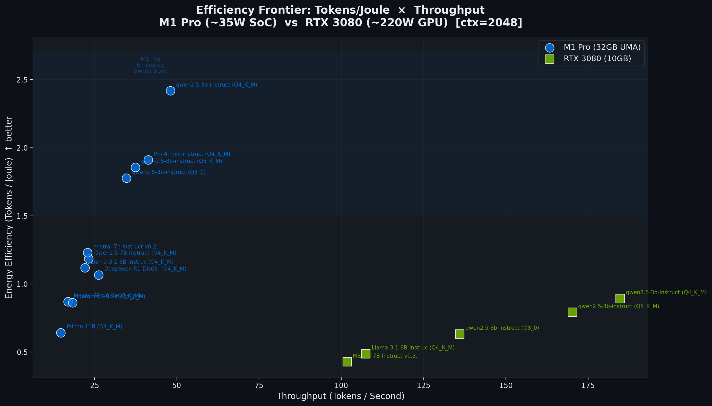

# LLM Inference Optimization Benchmark

I wanted to know which inference optimizations actually matter on a consumer GPU. Not what papers claim — what actually happens when you run them on a real model.

So I loaded Qwen2.5-0.5B on my RTX 3080, ran 2,289 experiments across 9 different optimization techniques, and found some things that surprised me.

## What I found

**The biggest surprise:** synthetic benchmarks massively understate how bad window-based KV cache eviction (StreamingLLM-style) is on real attention patterns. Papers report H2O being ~2-3× better than window eviction. On real Qwen2.5-0.5B attention, it's **7-65× better**, depending on the layer.



Layers 11, 16, and 21 spike hard — those are the layers with the most non-local attention patterns. Window eviction just throws away the tokens that matter most.

**Token confidence is completely task-dependent.** Same model, same threshold — reasoning tasks let you skip 87% of sampling operations, while translation tasks let you skip 0%. This isn't something you can fix with a global threshold.



**Optimizations stack multiplicatively.** I tested 108 combinations of KV cache eviction + head pruning + quantization. The combined quality is just the product of individual quality losses. No cancellation, no synergy — you can predict exactly what stacking will cost you.


The sweet spot on my 3080: H2O at 50% budget + INT4 quantization → 0.86 quality at 2.35× speed. Skip head pruning unless you really need the extra margin.

**At 90% cache eviction, window attention is basically dead.** H2O still retains 62% of attention quality. Window retains 2%. If you're doing aggressive KV cache compression on a VRAM-limited GPU, window eviction is not an option.



## All experiments

| Experiment | Trials | What I measured | What stood out |
|---|---|---|---|
| KV Cache Eviction | 72 | 6 policies (H2O, Window, SnapKV, etc.) | H2O wins everywhere |
| Token Confidence | 300 | Skip rates at different thresholds | 70% skip rate at temp=0.3 |
| Head Pruning | 39 | Progressive head removal | Cliff at 5%, then plateau to 80% |
| Quantization Sensitivity | 216 | Per-layer sensitivity to INT2-8 | Every 4th layer is fragile |
| Self-Speculative Decoding | 62 | Early exit layer selection | 50% exit → 2× speedup |
| PCIe Transfer | 36 | Pinned vs paged bandwidth | 24.4 vs 9.5 GB/s |
| Reasoning Token Waste | 480 | How many CoT tokens matter | 80% removable for easy tasks |
| Real Model Analysis | 976 | All of the above on actual Qwen2.5-0.5B | Where synthetic fails |
| Optimization Stacking | 108 | 108 combos of KV+prune+quant | Perfect multiplicative composition |

Some more charts from the experiments:

### Quantization sensitivity heatmap


Red = layers that break when quantized. There's a clear periodic pattern — every 4th layer has weight outliers that resist compression. Later layers (L17+) are safe to compress to INT4.

### PCIe bandwidth: pinned vs paged


If you're offloading KV cache to CPU RAM, use pinned memory. A 500MB cache offloads in 20ms pinned vs 57ms paged.

## Setup

```bash
git clone https://github.com/dilbersha/llm-inference-benchmark.git
cd llm-inference-benchmark
pip install -r requirements.txt
python -m llm_bench run      # detects your GPU, downloads a model, runs experiments
python -m llm_bench charts   # generates charts from the data
python -m llm_bench info     # shows your hardware info
```

The CLI figures out what GPU you have, picks a model that fits your VRAM, and downloads it from HuggingFace. On a 3080 it picks Phi-2 or Qwen2.5-0.5B.

## Data format

Every experiment outputs:
- JSON with full trial configs, metrics, and hardware context
- CSV for pandas / Excel
- Charts in `reports/charts/`

Raw data is in `reports/experiments/`. Feel free to dig through it.

---

## Hardware telemetry (the original project)

This repo also includes the cross-platform inference telemetry suite that started the project. It benchmarks raw throughput, energy efficiency (tokens per joule), and thermal stability.

### M1 Pro vs RTX 3080



13.7GB workload (Llama-3.1-8B Q8_0 at 8192 ctx): the 3080's 10GB VRAM can't even load it. M1 Pro runs it at 22 t/s at 35W.



M1 Pro gets 2.42 tokens/joule vs 0.90 on the 3080. The 3080 is faster in raw throughput, but it burns 10× more power per token.

> **Power note:** Apple numbers are whole-SoC power from `powermetrics`. NVIDIA numbers are GPU board power from `pynvml`. Not directly comparable, but they're what each vendor's API gives you.

### Hardware ledger

| GPU | Memory | Model | Quant | Peak T/J | Who |
|---|---|---|---|---|---|
| Apple M1 Pro | 32GB UMA | Qwen-2.5-3B | Q5_K_M | 2.40 | @dilbersha |
| Apple M1 Pro | 32GB UMA | Llama-3.1-8B | Q8_0 | 0.63 | @dilbersha |
| NVIDIA RTX 3080 | 10GB VRAM | Qwen-3B | Q4_K_M | 0.90 | @dilbersha |
| Your GPU? | — | — | — | — | Open a PR |

### Running the telemetry suite

```bash
# NVIDIA
./venv/bin/python src/orchestrator.py

# Apple Silicon (needs sudo for power readings)
sudo ./venv/bin/python src/orchestrator.py

# Generate dashboard
./venv/bin/python src/visualizer.py
```

Results land in `results/<hardware-slug>/`. The orchestrator detects your GPU automatically.

## Contributing

If you have different hardware, run the suite and open a PR with your CSV. I'm especially interested in:
- RTX 4090 / 5090 — how much does the next gen improve things?
- Apple M4 / M5 — does the UMA advantage keep scaling?
- AMD RDNA3+ / MI300X — ROCm efficiency data is basically nonexistent
- Intel Arc — nobody benchmarks these

## Methodology

- 10 runs per config, report mean with 95% CI
- WikiText-2 perplexity alongside throughput (speed means nothing if output is garbage)
- Continuous thermal logging (temperature + clock speed) to catch throttling
- Config hashing for reproducibility — every trial is traceable

## Project structure

```
src/
  orchestrator.py      # main benchmark runner + telemetry
  visualizer.py        # dashboard generation
  experiments/         # optimization experiments
    runner.py          # experiment framework (config hashing, JSON/CSV output)
    exp_real_model.py  # real model experiments on Qwen2.5-0.5B
    exp_stacking.py    # optimization stacking (108 combos)
    visualize.py       # chart generation
    visualize_real.py  # charts for real model findings
llm_bench/             # CLI (python -m llm_bench)
reports/
  experiments/         # raw experiment data (JSON + CSV)
  charts/              # generated visualizations
results/               # telemetry benchmark results by hardware
```

## License

[MIT](LICENSE)
