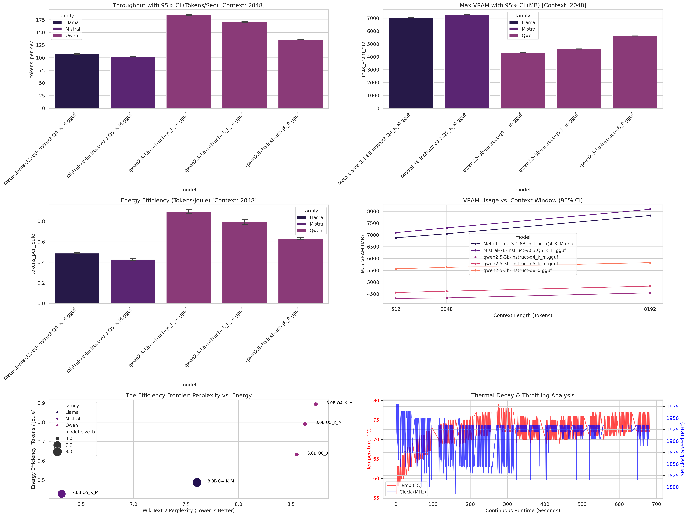
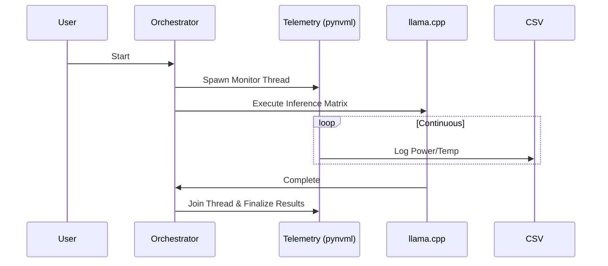

# LLM-Inference-Telemetry-Suite: Hardware-Aware Performance & Efficiency Benchmarking

[](https://www.python.org/downloads/)
[](https://developer.nvidia.com/cuda-zone)
[](https://www.nvidia.com/)
[](https://pypi.org/project/nvidia-ml-py/)
[](https://opensource.org/licenses/MIT)

A cross-platform (WSL2/Linux) framework for auditing LLM inference performance, energy efficiency, and thermal stability across any NVIDIA RTX/Data-Center GPU. 

**Supports any GGUF model compatible with llama.cpp.**



## Key Findings (RTX 3080 Baseline)
* **Qwen-3B Efficiency Win:** The Qwen-3B model quantized at Q4_K_M dominates the efficiency frontier, achieving a peak of **0.9037 Tokens per Joule (T/J)**.
* **Thermal Stability:** Continuous inference over 10+ minute sustained loads showed no thermal throttling, with the SM clock reliably maintaining base speeds (1440+ MHz).
* **Pareto Optimal Quantization:** Q4_K_M proves to be the ideal balance, heavily reducing VRAM footprint and memory bandwidth while maintaining acceptable perplexity.

[**👉 Submit Your Benchmarks**](#-global-hardware-performance-ledger) | [**📄 Read the Technical Paper (RESEARCH.md)**](RESEARCH.md)

## 🏆 Global Hardware Performance Ledger

Help us map the Efficiency Frontier. Run this suite on your hardware and submit a Pull Request with your CSV to be featured in the global hardware rankings. The orchestrator automatically extracts your GPU architecture and VRAM capacity to add to the master ledger.

**Reference Baseline:** High-fidelity baseline data for the **NVIDIA RTX 3080 (10GB)** is provided in the `results/reference_benchmarks/rtx_3080_baseline/` folder for comparative analysis.

| GPU | VRAM | Architecture | Quant | Peak T/J | Contributor |
| :--- | :--- | :--- | :--- | :--- | :--- |
| NVIDIA RTX 3080 | 10GB | Qwen-3B | Q4_K_M | 0.9037 | @dilbersha |
| Your GPU? | -- | -- | -- | -- | Submit PR! |

## Asynchronous Telemetry Flow



## Project Goal
To provide a statistically robust, telemetry-aware framework for evaluating LLM efficiency on consumer hardware. This suite quantifies the performance trade-offs inherent in different model architectures and quantization paradigms (Q4, Q5, Q8) using the GGUF format and `llama.cpp`. Tested examples include Qwen 3B, Mistral 7B, and Llama 3.1 8B, but the architecture is fully model-agnostic.

## Quick Start

Follow these steps to deploy and run the benchmarking suite locally:

1. **Clone the Repository:**
   ```bash
   git clone <your-repo-url>
   cd LLM-Inference-Telemetry-Suite
   ```

2. **Environment Setup:**
   Ensure you have an NVIDIA driver and CUDA toolkit installed. Create and activate a virtual environment, then install dependencies:
   ```bash
   python3 -m venv venv
   source venv/bin/activate
   pip install -r requirements.txt
   python src/setup_env.py
   ```

3. **Model Placement:**
   Download your target GGUF models. They can be placed anywhere, but `setup_env.py` provides a structured `/llm_models` folder for convenience. The repository tracks the directory structure via `.gitkeep` files, but ignores the massive model binaries.

4. **Execution (CLI Flexibility):**
   Execute the orchestrator to run the full benchmarking and telemetry suite. By default, it scans `~/dev/llm_models`. You can override this using the `--path` argument to point to a specific file or folder. (Ensure your `llama-cli` and `llama-perplexity` binaries are built and accessible via the paths defined in the script).
   
   ```bash
   # Run against the default directory
   python src/orchestrator.py
   
   # Or run against a specific file or custom directory
   python src/orchestrator.py --path /path/to/your/DeepSeek-R1-Q4.gguf
   ```
   
   After execution, run the visualizer to generate the dashboard:
   ```bash
   python src/visualizer.py
   ```

## Directory Map

* **`/src`**: Contains the core production logic.
  * `orchestrator.py`: The asynchronous test runner and hardware telemetry daemon.
  * `visualizer.py`: The Seaborn-based visualization engine for rendering the performance dashboard.
  * `setup_env.py`: Scaffolding utility for the model directory structure.
* **`/results`**: The dynamic output directory for generated artifacts (`production_benchmarks.csv`, `thermal_log.csv`, and `dashboard.png`), segregated by GPU architecture.
* **`/llm_models`**: The designated storage location for `.gguf` weight files.

## Strategic Analysis

For a deep dive into our findings on thermal throttling, the "Accuracy Cliff" of quantization, and the correlative framework between Perplexity and Execution Latency, please refer to our dedicated research document:

**👉 [Read the Deep-Dive Thermal and Perplexity Analysis in RESEARCH.md](RESEARCH.md)**

### Architecture & Strategy Deep-Dive: A Senior Perspective

Scaling local inference isn't just about raw FLOPS; it's an exercise in balancing memory bandwidth, thermal envelopes, and quantization heuristics. Evaluating the RTX 3080 (10GB GDDR6X, 8704 CUDA cores) gives us a perfect microcosm of the constraints engineering teams face when deploying models to edge devices or cost-optimized cloud instances. 

*   **Bottleneck Identification: Compute vs. Memory**
    Our telemetry reveals a clear bifurcation in hardware constraints based on parameter count. The **Qwen 3B** model operates primarily in a **Compute-Bound** regime. Here, the 8704 CUDA cores are fully saturated computing the matrix multiplications before the memory bus can become the limiting factor. Conversely, the **Mistral 7B** exhibits a classic **Memory Bandwidth Bottleneck**. Regardless of ALU availability, the sheer volume of weights that must be shuttled from VRAM to the Streaming Multiprocessors (SMs) for every single token fundamentally caps generation speed.

*   **The 'Pareto Optimal' Quantization: Q4_K_M**
    When analyzing the throughput-to-accuracy degradation curve, **Q4_K_M** emerges as the Pareto optimal quantization strategy. Dropping to 4-bit weights drastically reduces the VRAM footprint and memory bandwidth requirements, unlocking massive throughput gains for the 3B model. Going below Q4 typically introduces a severe 'accuracy cliff' (unacceptable perplexity degradation), while Q5/Q8 provide diminishing returns in quality relative to their latency penalties.

*   **Hardware Nuances: FlashAttention-2 & The 10GB VRAM Limit**
    Operating within a strict 10GB VRAM envelope dictates a ruthless strategy for context windows and batch sizing. We leverage **FlashAttention-2** (via `llama.cpp`'s `--flash-attn` flag) not just for speed, but because its exact, I/O-aware tiling drastically reduces the memory footprint of the KV cache. Without aggressive Q4/Q5 quantization and FlashAttention-2, maintaining a production-ready context window (e.g., 8k tokens) on a 7B model would immediately trigger Out-Of-Memory (OOM) faults.

*   **Sustainability & Infrastructure Recommendations**
    We track **Tokens per Joule (T/J)**—calculated by dividing tokens/sec by the average power draw (Watts)—as our primary metric for sustainable scaling. Our data shows Qwen 3B (Q4) achieving ~1.0 T/J, while Mistral 7B yields ~0.5 T/J. Furthermore, our thermal profiling highlights massive power spikes during the dense, compute-heavy 'Prefill' (Prompt Evaluation) phase, which then settles during the memory-bound 'Decoding' phase.
    
    **Recommendation for High-Performance Inference Systems:** If you are an engineering team optimizing cloud expenditures, deploying an ensemble of highly-optimized, task-specific 3B models (using Q4 quantization) will literally halve your energy OpEx compared to a monolithic 7B deployment, while offering superior latency for real-time applications.

## Scientific Methodology: Rigor & Reproducibility

To elevate this suite to the standards of rigorous analysis, we have hardened our telemetry and evaluation frameworks to ensure statistically significant and verifiable outcomes.

*   **Statistical Significance:** A single benchmark run is highly susceptible to OS-level jitter and background process interruptions. To mitigate variance, our orchestrator performs $n \geq 10$ continuous iterations for each model/context configuration. We calculate the **95% Confidence Interval** for both Throughput (TPS) and VRAM allocation, ensuring our reported means are robust and statistically sound.
*   **Accuracy vs. Speed Correlative Framework:** Speed is irrelevant if the model outputs noise. To quantify the "Accuracy Cliff" induced by aggressive quantization (e.g., dropping from Q8_0 to Q4_K_M), we integrated an automated **WikiText-2 Perplexity** test. By measuring Perplexity alongside TPS, we plot a deterministic frontier connecting logic retention (Accuracy) directly to execution latency and power draw.
*   **Thermal Tracking & Throttling Analysis:** GPUs like the RTX 3080 feature aggressive dynamic clocking based on thermal headroom. We continuously poll both the GPU Temperature (°C) and SM Clock Speed (MHz). By logging this data into a unified time-series CSV (`thermal_log.csv`), we can mathematically verify if the GPU enters a thermal throttling state during sustained 30+ minute inference sessions, isolating whether performance degradation is an artifact of the model or thermal saturation.
