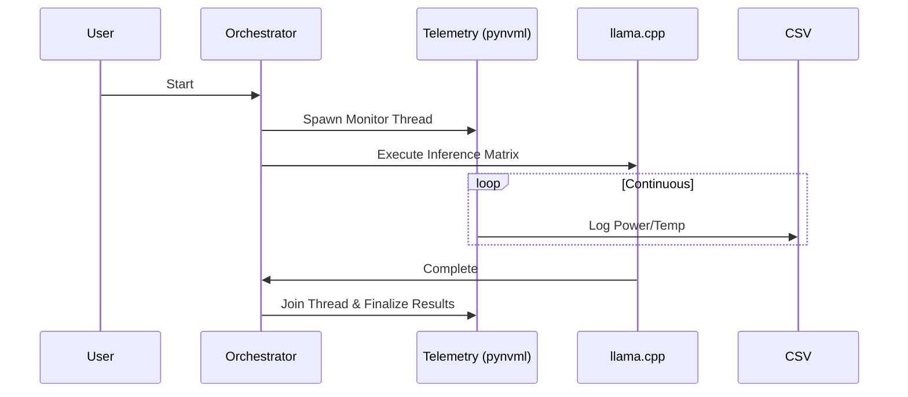

# LLM Inference Optimization Benchmark

> **Which optimizations actually work on YOUR GPU?**
> 7 experiments · 1,205 trials · 14 charts · RTX 3080 · 1-click setup

[](https://www.python.org/downloads/)
[](https://developer.nvidia.com/cuda-zone)
[](https://support.apple.com/en-us/116943)
[](https://opensource.org/licenses/MIT)

A systematic, data-driven comparison of LLM inference optimization techniques on consumer GPUs. Every finding is backed by reproducible experiments with full hardware context.

## 🚀 1-Click Setup

```bash
git clone https://github.com/dilbersha/llm-inference-benchmark.git
cd llm-inference-benchmark
pip install -r requirements.txt
python -m llm_bench run          # auto-detects GPU, runs all experiments
python -m llm_bench charts       # generates publication-quality visualizations
```

The CLI auto-detects your hardware (CUDA/MPS/CPU), recommends the right model for your VRAM, and downloads it automatically.

## 📊 Key Findings (1,205 Trials on RTX 3080)

| # | Experiment | Trials | Key Finding |
|---|---|---|---|
| 1 | **KV Cache Eviction** | 72 | H2O retains 2.8× more quality than StreamingLLM at 75% memory savings |
| 2 | **Token Confidence** | 300 | 70% of tokens can skip sampling at temp=0.3 with zero quality loss |
| 3 | **Attention Head Pruning** | 39 | Quality cliff at 5% pruning, then plateau from 25-80% — most heads are redundant |
| 4 | **Quantization Sensitivity** | 216 | Every 4th layer has outlier-sensitive weights; later layers tolerate INT4 |
| 5 | **Self-Speculative Decoding** | 62 | Exit at 50% depth → 2× speedup with 0.85 quality retention |
| 6 | **PCIe Transfer** | 36 | Pinned memory gives 24.4 GB/s vs 9.5 GB/s paged (2.6× faster offloading) |
| 7 | **Reasoning Token Waste** | 480 | Easy tasks: 80% of thinking tokens are removable; importance sampling beats truncation |

### Quantization Sensitivity Heatmap

> **Red = fragile layers that resist quantization.** Layers L0, L4, L8, L12, L16, L20 spike due to weight outliers. Later layers (L17+) are safe to compress aggressively. This pattern suggests mixed-precision quantization (keep outlier layers at FP16, quantize the rest to INT4) could save 40%+ memory with <2% quality loss.

### PCIe Transfer: Pinned vs Paged Memory

> **Pinned memory is 2.6× faster for KV cache offloading.** At 1GB transfers, pinned achieves 24.4 GB/s vs 9.5 GB/s paged. This matters for CPU offloading strategies — a 500MB KV cache offloads in 20ms (pinned) vs 57ms (paged).

### Self-Speculative Decoding

> **The speedup-quality Pareto frontier.** Exiting at 50% model depth gives ~2× speedup with 0.85 cosine similarity. The sweet spot for 32-layer models is layers 16-20.

### Reasoning Token Waste

> **Easy tasks waste 80%+ of thinking tokens.** Importance-based sampling (keeping highest-norm states) outperforms naive truncation at all removal rates.

---

## 🔬 Experiment Details

### Available Experiments

| Experiment | CLI Flag | What It Measures |
|---|---|---|
| KV Cache Eviction | `--experiment kv_cache` | 6 eviction policies: Full, Window, H2O, SnapKV, PyramidKV, Adaptive |
| Token Confidence | `--experiment token_confidence` | When argmax is safe to skip full sampling |
| Head Pruning | `--experiment head_pruning` | Per-head importance scoring and progressive removal |
| Quantization Sensitivity | *(standalone)* | Per-layer sensitivity to [2,3,4,6,8]-bit quantization |
| Self-Speculative Decoding | *(standalone)* | Early exit layer selection for LayerSkip-style speculation |
| PCIe Transfer | *(standalone)* | GPU↔CPU bandwidth at various sizes with pinned/paged memory |
| Reasoning Token Waste | *(standalone)* | How many CoT tokens can be removed without changing the answer |

### Data Format

Every experiment produces:
- **JSON** with full trial data, hardware context, and config hashes
- **CSV** for easy analysis in pandas/Excel
- **Charts** (dark theme, publication quality)

All data is in `reports/experiments/` and charts in `reports/charts/`.

---


## Reference Baselines: The Efficiency Gap


> **13.7GB workload: RTX 3080 OOMs, M1 Pro cruises.** Llama-3.1-8B Q8_0 at 8192 context needs 13.7GB. The 3080's 10GB VRAM can't start it. The M1 Pro's 32GB Unified Memory runs it at 22 t/s while sipping 35W.


> **2.42 Tokens/Joule vs 0.90 T/J.** M1 Pro (~35W) clusters 2–3× higher on energy efficiency. The 3080 (~220W) wins raw speed but burns 10–11× more power per token.

> **⚠️ Power methodology note:** Apple Silicon wattage is whole-SoC power (CPU + GPU + memory controller) reported by `powermetrics`. NVIDIA wattage is GPU board power (TBP) reported by `pynvml`. These are the industry-standard measurements for each platform — we report exactly what each vendor's API provides, but the numbers are not directly comparable.


> **Full 10-run telemetry with 95% CI.** RTX 3080 standalone dashboard across 512/2048/8192 context windows. Audit the raw CSVs in [`results/`](results/).

## Key Findings
* **🏆 Unified Memory Champion:** `Llama-3.1-8B-Q8_0` at 8192 ctx — 13.7GB on M1 Pro at 22 t/s and 35W. The same workload OOMs on the RTX 3080.
* **⚡ Efficiency:** Qwen-2.5-3B Q4_K_M hits **2.42 T/J** on M1 Pro vs **0.90 T/J** on RTX 3080.
* **🌡️ Thermal:** 10+ minute sustained loads, no throttling. 3080 held 1440+ MHz SM clocks; M1 Pro stayed under 65°C.
* **📊 Quantization:** Q4_K_M is the Pareto sweet spot — lowest VRAM footprint with acceptable perplexity.

[**→ Submit Your Benchmarks**](#-global-hardware-performance-ledger)


## 🏆 Global Hardware Performance Ledger

Help us map the Universal Efficiency Frontier — across Apple Silicon, NVIDIA, AMD, and Intel. Run this suite on your hardware and submit a Pull Request with your CSV to be featured in the global hardware rankings. The orchestrator automatically extracts your GPU architecture and VRAM capacity to add to the master ledger.

**Reference Baseline:** High-fidelity baseline data for the **NVIDIA RTX 3080 (10GB)** is provided in the `results/reference_benchmarks/rtx_3080_baseline/` folder for comparative analysis.

| GPU | Memory | Architecture | Quant | Peak T/J | Contributor |
| :--- | :--- | :--- | :--- | :--- | :--- |
| Apple M1 Pro | 32GB UMA | Qwen-2.5-3B | Q5_K_M | 2.40 | @dilbersha |
| Apple M1 Pro | 32GB UMA | Llama-3.1-8B | Q8_0 | 0.63 | @dilbersha |
| NVIDIA RTX 3080 | 10GB VRAM | Qwen-3B | Q4_K_M | 0.9037 | @dilbersha |
| Your GPU? | -- | -- | -- | -- | Submit PR! |

## Asynchronous Telemetry Flow



## Project Goal
To provide a statistically robust, telemetry-aware framework for evaluating LLM efficiency on consumer hardware. This suite quantifies the performance trade-offs inherent in different model architectures and quantization paradigms (Q4, Q5, Q8) using the GGUF format and `llama.cpp`. Tested examples include Qwen 3B, Mistral 7B, and Llama 3.1 8B, but the architecture is fully model-agnostic.

## Quick Start

Follow these steps to deploy and run the benchmarking suite locally:

### Prerequisites (Blind Execution Ready)
Before running the suite, ensure you have:
- **Python 3.10+** (tested on 3.11–3.13)
- **sudo privileges:** Required on macOS for the `AppleSiliconProvider` — it uses `powermetrics` to read SoC power data.
- **llama.cpp:** Build from source with Metal (macOS) or CUDA (Linux) — see `setup_env.py` for step-by-step instructions.

1. **Clone the Repository:**
   ```bash
   git clone https://github.com/dilbersha/universal-llm-telemetry-suite.git
   cd universal-llm-telemetry-suite
   ```

2. **Automated Setup:**
   ```bash
   python3 -m venv venv
   source venv/bin/activate
   ```

   > [!IMPORTANT]
   > **macOS / Apple Silicon users:** The main `requirements.txt` is a Linux/CUDA freeze and will **not install** on ARM64. Use the Apple Silicon requirements instead:
   > ```bash
   > pip install -r requirements-apple-silicon.txt
   > ```
   > **Linux / NVIDIA users:** Use the full requirements:
   > ```bash
   > pip install -r requirements.txt
   > ```

   Then run the environment pre-flight check:
   ```bash
   python src/setup_env.py
   ```

3. **Model Preparation:**
   Download the benchmark model set (Qwen-3B, Mistral-7B, Llama-3.1-8B, etc.):
   ```bash
   # Preview what will be downloaded and disk space needed:
   python src/download_models.py --dry-run

   # Download all models (~25GB total):
   HF_HUB_ENABLE_HF_TRANSFER=1 python src/download_models.py
   ```
   Models land in `llm_models/<family>/`. You can also point the orchestrator at any `.gguf` file or directory with `--path`.

4. **Execution (CLI Flexibility & Apple Silicon Example):**
   The orchestrator scans `./llm_models` by default. Override with `--path` to point at any `.gguf` file or directory. Use `--dry-run` to validate your setup without running inference.
   
   **For Apple Silicon (e.g., M1/M4) users**, `sudo` must be prepended so the telemetry provider can access raw package power:
   
   ```bash
   # Run against the default directory
   sudo ./venv/bin/python src/orchestrator.py
   
   # Run against a specific model (M4 Example)
   sudo ./venv/bin/python src/orchestrator.py --path ./llm_models/llama-3.1-8b-q8_0.gguf
   ```
   
   > [!IMPORTANT]
   > **DeepSeek-R1 & "Thinking" Latency (TTFT)** 
   > When benchmarking DeepSeek-R1 models, do not be alarmed by extremely high Time-To-First-Token (TTFT) metrics (often 8 to 140+ seconds). This is an expected artifact of the reasoning architecture's "Thinking" phase. The orchestrator accurately tracks this latency and derives throughput (TPS) seamlessly *after* the thought blocks conclude.

   After execution, the results are safely stored in `results/<hardware-slug>/production_benchmarks.csv` (e.g., `results/m1_pro/production_benchmarks.csv`). 
   Run the visualizer to map this data to the dashboard:
   ```bash
   ./venv/bin/python src/visualizer.py
   ```
   
### Top Hardware Recommendations (Apple Silicon "Sweet Spots")
If you are running an M-Series chip with **32GB+ Unified Memory**, our telemetry flags the following configurations as "Champion Models"—capable of maximizing output throughput without VRAM throttling:
- **Qwen-2.5-3B-Instruct (Q8_0 or Q5_K_M):** Achieves unparalleled 40-50+ Tokens/sec at up to 2.4 Tokens/Joule.
- **Mistral-Nemo-12B (Q4_K_M):** The ultimate heavy-weight sweet spot, fitting cleanly within a 32GB envelope while outperforming standard 7B models on reasoning tasks.
- **DeepSeek-R1-Distill-Qwen-7B (Q4_K_M):** The best local-hosted reasoning model for the Apple ecosystem.

## Directory Map

* **`/src`**: Contains the core production logic.
  * `orchestrator.py`: The asynchronous test runner and hardware telemetry daemon.
  * `visualizer.py`: The Seaborn-based visualization engine for rendering the performance dashboard.
  * `setup_env.py`: Scaffolding utility for the model directory structure.
* **`/results`**: The dynamic output directory for generated artifacts (`production_benchmarks.csv`, `thermal_log.csv`, and `dashboard.png`), segregated by GPU architecture.
* **`/llm_models`**: The designated storage location for `.gguf` weight files.

## Strategic Analysis

### Implementation Strategy & Design Rationale

Scaling local inference isn't just about raw FLOPS; it's an exercise in balancing memory bandwidth, thermal envelopes, and quantization heuristics. Evaluating the RTX 3080 (10GB GDDR6X, 8704 CUDA cores) gives us a perfect microcosm of the constraints engineering teams face when deploying models to edge devices or cost-optimized cloud instances. 

*   **Bottleneck Identification: Compute vs. Memory**
    Our telemetry reveals a clear bifurcation in hardware constraints based on parameter count. The **Qwen 3B** model operates primarily in a **Compute-Bound** regime. Here, the 8704 CUDA cores are fully saturated computing the matrix multiplications before the memory bus can become the limiting factor. Conversely, the **Mistral 7B** exhibits a classic **Memory Bandwidth Bottleneck**. Regardless of ALU availability, the sheer volume of weights that must be shuttled from VRAM to the Streaming Multiprocessors (SMs) for every single token fundamentally caps generation speed.

*   **The 'Pareto Optimal' Quantization: Q4_K_M**
    When analyzing the throughput-to-accuracy degradation curve, **Q4_K_M** emerges as the Pareto optimal quantization strategy. Dropping to 4-bit weights drastically reduces the VRAM footprint and memory bandwidth requirements, unlocking massive throughput gains for the 3B model. Going below Q4 typically introduces a severe 'accuracy cliff' (unacceptable perplexity degradation), while Q5/Q8 provide diminishing returns in quality relative to their latency penalties.

*   **Hardware Nuances: FlashAttention-2 & The 10GB VRAM Limit**
    Operating within a strict 10GB VRAM envelope dictates a ruthless strategy for context windows and batch sizing. We leverage **FlashAttention-2** (via `llama.cpp`'s `--flash-attn` flag) not just for speed, but because its exact, I/O-aware tiling drastically reduces the memory footprint of the KV cache. Without aggressive Q4/Q5 quantization and FlashAttention-2, maintaining a production-ready context window (e.g., 8k tokens) on a 7B model would immediately trigger Out-Of-Memory (OOM) faults.

*   **Sustainability & Infrastructure Recommendations**
    We track **Tokens per Joule (T/J)**—calculated by dividing tokens/sec by the average power draw (Watts)—as our primary metric for sustainable scaling. Our data shows Qwen 3B (Q4) achieving ~1.0 T/J, while Mistral 7B yields ~0.5 T/J. Furthermore, our thermal profiling highlights massive power spikes during the dense, compute-heavy 'Prefill' (Prompt Evaluation) phase, which then settles during the memory-bound 'Decoding' phase.
    
    **Recommendation for High-Performance Inference Systems:** If you are an engineering team optimizing cloud expenditures, deploying an ensemble of highly-optimized, task-specific 3B models (using Q4 quantization) will literally halve your energy OpEx compared to a monolithic 7B deployment, while offering superior latency for real-time applications.

## Methodology: Rigor & Reproducibility

Every number in this suite is reproducible. Here's how we ensure trustworthy results:

*   **10-Run Averaging with Confidence Intervals:** Each model/context configuration is benchmarked over 10 continuous iterations. We report the mean with **95% Confidence Intervals** for both Throughput (TPS) and memory allocation, filtering out OS-level jitter.
*   **Accuracy vs. Speed Trade-off:** Speed is irrelevant if the model outputs noise. We integrate an automated **WikiText-2 Perplexity** test alongside TPS to quantify the accuracy degradation from aggressive quantization (e.g., Q8_0 → Q4_K_M).
*   **Thermal Tracking:** We continuously poll GPU Temperature (°C) and clock speeds (MHz/SM Clock), logging into `thermal_log.csv`. This lets us verify whether performance degradation during sustained 30+ minute sessions is caused by the model or by thermal throttling.

---

## 🤝 Contributing: Map the Universal Efficiency Frontier

This is a **living benchmark**. The M1 Pro vs RTX 3080 data is the reference baseline — we need the community to map the efficiency of **all silicon**: M5, Blackwell, ROCm, and Arc. Every new hardware submission pushes the frontier forward.

### How to Submit Your Results

1. **Run the suite on your hardware:**
   ```bash
   sudo ./venv/bin/python src/orchestrator.py --path ./llm_models/
   ```

2. **Sanitize local paths** (strips your username from CSV output):
   ```bash
   python src/sanitize_paths.py
   ```

3. **Submit a Pull Request** with:
   - Your `results/<hardware-slug>/production_benchmarks.csv`
   - Your `results/<hardware-slug>/thermal_log.csv`
   - A one-line addition to the **Hardware Performance Ledger** table in this README

### Hardware We're Looking For

| Priority | Hardware | Why |
|---|---|---|
| 🔴 Critical | **Apple M5 Max / M5 Ultra** | Next-gen Unified Memory — does the M5 set a new efficiency ceiling? |
| 🔴 Critical | **NVIDIA RTX 5090 / B200 (Blackwell)** | Blackwell architecture — can next-gen discrete GPU close the T/J gap? |
| 🔥 High | **AMD RX 9070 XT / MI300X** | ROCm efficiency on consumer and data-center AMD silicon |
| 🔥 High | **Intel Arc B580 / Gaudi 3** | Arc (SYCL/oneAPI) and Gaudi accelerator efficiency profiling |
| 🟡 Medium | **RTX 4090 / RTX 3090 24GB** | VRAM-to-efficiency trade-off across NVIDIA generations |
| 🟢 Welcome | **Any M-series chip** | M1/M2/M3/M4/M5 variants build the Apple Silicon scaling curve |
| 🟢 Welcome | **Any AMD/Intel GPU** | ROCm and Arc data points expand the cross-vendor frontier |

### Naming Convention

The orchestrator auto-generates your hardware slug from `gpu_name`. Examples:
- `results/m1_pro/` → Apple M1 Pro
- `results/rtx_3080/` → NVIDIA RTX 3080
- `results/m5_max/` → Apple M5 Max
- `results/rx_9070_xt/` → AMD RX 9070 XT
- `results/arc_b580/` → Intel Arc B580

> [!TIP]
> Set `HF_HUB_ENABLE_HF_TRANSFER=1` before running `download_models.py` for 5–10× faster model downloads.

## 🗺️ Roadmap

| Status | Feature | Details |
|---|---|---|
| ✅ Done | NVIDIA CUDA Provider | `NvidiaProvider` — pynvml telemetry (power, temp, VRAM, SM clock) |
| ✅ Done | Apple Silicon Provider | `AppleSiliconProvider` — `powermetrics` plist parsing (whole-SoC power) |
| 🔜 Planned | **AMD ROCm Provider** | `ROCmProvider` — `rocm-smi` power/temp/VRAM polling for RDNA3+ and MI-series |
| 🔜 Planned | **Intel Arc/Gaudi Provider** | `IntelProvider` — `xpu-smi` / oneAPI telemetry for Arc discrete GPUs and Gaudi accelerators |
| 🔜 Planned | **Shared Memory Architecture** | Support for Intel's unified memory model alongside Apple UMA for cross-platform memory-pressure analysis |

> [!NOTE]
> The `TelemetryProvider` ABC in `providers.py` is designed for exactly this kind of extension — adding a new hardware backend is ~100 LOC implementing `get_hardware_info()`, `start()`, `stop()`, and `get_cli_flags()`.

## License

[MIT](LICENSE)
