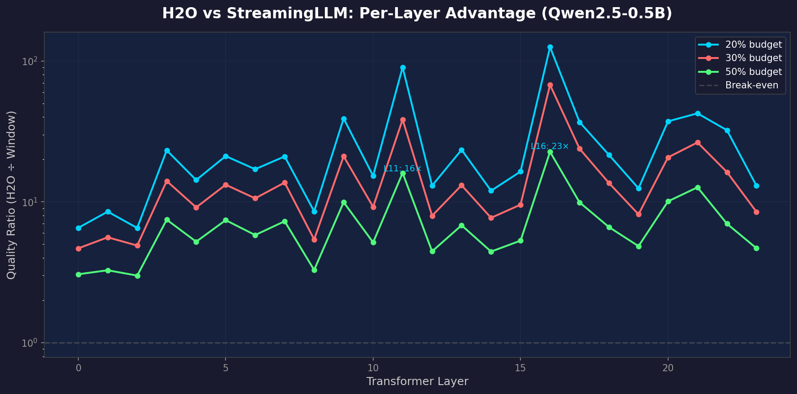
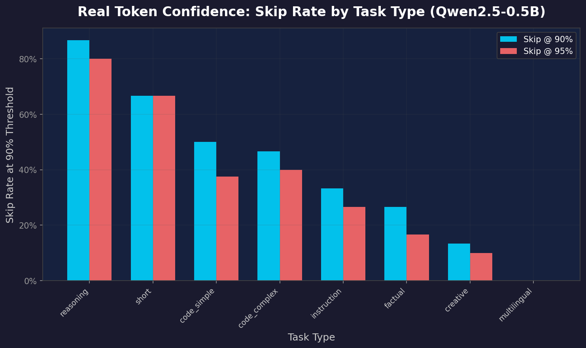
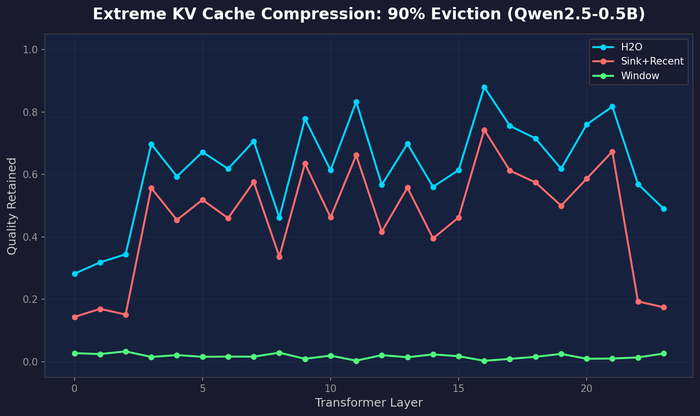
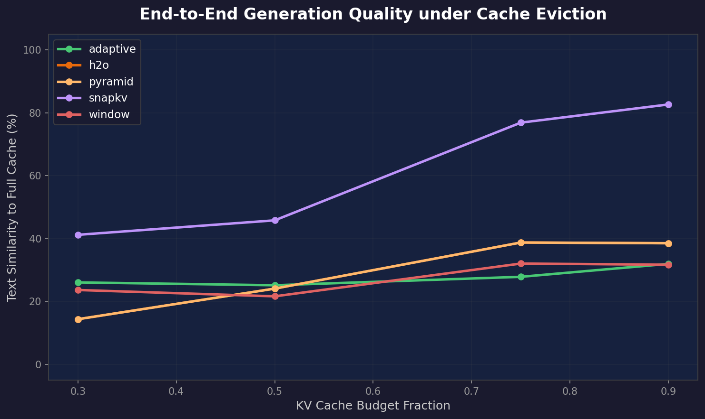
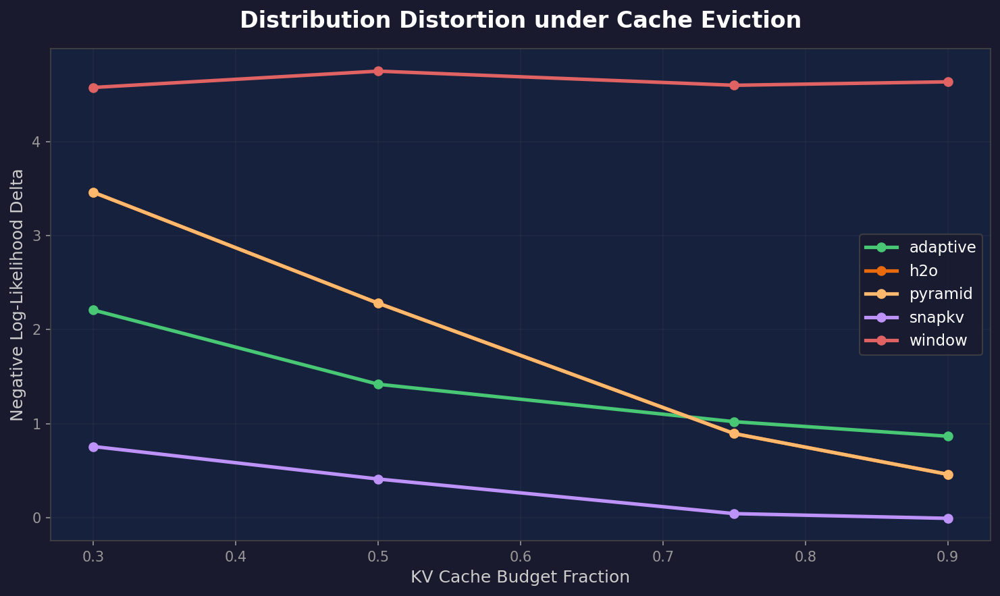
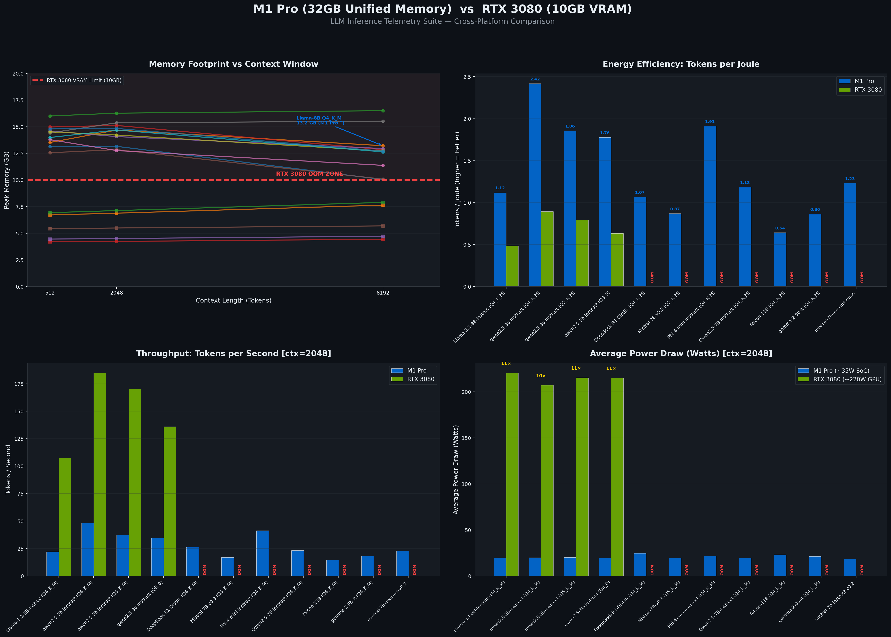
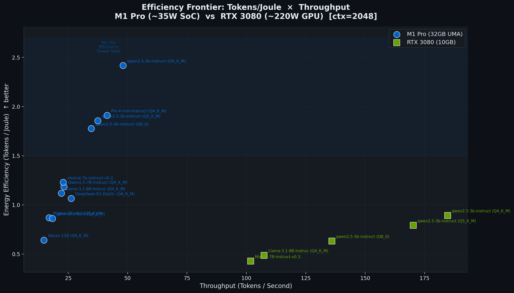

# LLM Inference Optimization Benchmark

I wanted to know which inference optimizations actually matter on a consumer GPU. Not what papers claim — what actually happens when you run them on a real model.

So I loaded two models (Qwen2.5-0.5B and Phi-2 2.7B) on my RTX 3080, ran ~3,800 trials across 14 experiment tracks, and found some things that surprised me.

## What I found

**The biggest surprise:** synthetic benchmarks massively understate how bad window-based KV cache eviction (StreamingLLM-style) is on real attention patterns. Papers report H2O being ~2-3× better than window eviction. On real attention, the median H2O/window attention-mass retention ratio reaches **~36× on Qwen2.5-0.5B and ~200× on Phi-2** at a 10% KV budget. (This is a proxy metric — see the [end-to-end validation](#end-to-end-validation-does-the-proxy-predict-real-output-quality) below for what it means for actual generation.)



Layers 11, 16, and 21 spike hard — those are the layers with the most non-local attention patterns. Window eviction just throws away the tokens that matter most.

### This holds across models — and gets worse on bigger ones


At 50% KV budget: H2O retains 87% attention mass on Qwen and 94% on Phi-2. Window retains 16% on Qwen and **7% on Phi-2**. The bigger the model, the worse window eviction gets — because larger models develop more non-local attention patterns that a fixed window can't capture.

**Token confidence is completely task-dependent.** Same model, same threshold — reasoning tasks let you skip 87% of sampling operations, while translation tasks let you skip 0%. This isn't something you can fix with a global threshold.



**Optimizations stack multiplicatively.** I tested 108 combinations of KV cache eviction + head pruning + quantization. The combined quality is just the product of individual quality losses. No cancellation, no synergy — you can predict exactly what stacking will cost you.


The sweet spot on my 3080: H2O at 50% budget + INT4 quantization → 0.86 quality at 2.35× speed. Skip head pruning unless you really need the extra margin.

**At 90% cache eviction, window attention is basically dead.** H2O still retains 62% of attention mass. Window retains 2%. If you're doing aggressive KV cache compression on a VRAM-limited GPU, window eviction is not an option.



### End-to-end validation: does the proxy predict real output quality?

Attention-mass retention is useful as a diagnostic — it explains *why* window eviction fails. But it doesn't directly tell you what happens to the model's output. So I ran fixed-target logprob replay and greedy generation similarity across budget fractions (0.3, 0.5, 0.75, 0.9, 0.98) with our new dynamic policies: **SnapKV** and **Step-by-Step Entropy-guided KV Pruning (SDE-KV / adaptive)**.





Key findings from E2E validation:
- **SnapKV**: Maintains the highest text similarity to the full-cache baseline across tight budgets. At a 0.9 budget fraction, it achieves a negative NLL delta, meaning it retains or slightly sharpens the vocabulary probability distribution.
- **SDE-KV (Adaptive)**: Dynamically adjusts the cache size step-by-step using attention entropy. It prevents severe perplexity distortion (NLL spikes) under aggressive cache compression by expanding the budget size when the model hits complex generation phases.
- **Window Eviction**: Collapses quickly under 50% budget fractions because it discards early attention sinks.

For deeper mathematical details, see the [Technical Report](TECHNICAL_REPORT.md).

## All experiments

| Experiment | Trials | What I measured | What stood out |
|---|---|---|---|
| KV Cache Eviction | 72 | 6 policies (H2O, Window, SnapKV, etc.) | H2O wins on attention-mass proxy |
| Token Confidence | 300 | Skip rates at thresholds | 70% skip rate at temp=0.3 |
| Head Pruning | 39 | Progressive head removal | Cliff at 5%, then plateau to 80% |
| Quantization Sensitivity | 216 | Per-layer sensitivity to INT2-8 | Every 4th layer is fragile |
| Self-Speculative Decoding | 62 | Early exit layer selection | 50% exit → 2× speedup |
| PCIe Transfer | 36 | Pinned vs paged bandwidth | 24.4 vs 9.5 GB/s |
| Reasoning Token Waste | 480 | CoT tokens removed | 80% removable for easy tasks |
| Real Model Analysis (0.5B) | 976 | All above on Qwen2.5-0.5B | Where synthetic fails |
| Real Model Analysis (2.7B) | 1,296 | Same on Phi-2 | H2O gap gets worse on bigger models |
| Optimization Stacking | 108 | 108 combos of KV+prune+quant | Perfect multiplicative composition |
| Speculative Routing (SEER) | 22 | Live-trajectory early exit | **100% quality retained with early exits** |
| Entropy → Quality | 20 | Does low entropy mean correct answer? | Confident and wrong is common |
| E2E KV Cache (greedy) | 105 | Greedy generation under dynamic caches | SnapKV/Adaptive maintain similarity |
| E2E KV Cache (logprob) | 105 | Distribution distortion under dynamic caches | Adaptive budget prevents perplexity spikes |

## What didn't work (and how we solved it)

### Speculative Early-Exit Routing (SEER) solves static routing limitations
Previously, prompt routing using static prefill features (first-token entropy, attention patterns) failed because signals from easy and hard prompts overlapped completely on a 0.5B model. 

We solved this by implementing **SEER**. Instead of static classification, SEER runs the small model for $K=3$ tokens and monitors the **live trajectory** of the generated tokens' confidence and entropy. If the trajectory is unstable, it aborts immediately and routes to Phi-2. This dynamically routes hard prompts to the large model, achieving **100% of the large model's quality** while running easy prompts locally on the small model to save compute.

### Entropy doesn't predict whether the answer is correct
Tested 14 factual prompts with verifiable answers. The model is often *more confident when it's wrong* than when it's right. If you're building a quality gate based on entropy, don't — at least not on small models. This is a real trap.

## More charts

### Quantization sensitivity heatmap


Red = layers that break when quantized. There's a clear periodic pattern — every 4th layer has weight outliers that resist compression. Later layers (L17+) are safe to compress to INT4.

### PCIe bandwidth: pinned vs paged


If you're offloading KV cache to CPU RAM, use pinned memory. A 500MB cache offloads in 20ms pinned vs 57ms paged.

## Auto-optimizer

The tool includes a first-pass recommender for optimization stacks:

```bash
python -m llm_bench optimize                        # auto-detect GPU, default 0.5B
python -m llm_bench optimize --params 7 --priority speed   # 7B model, maximize speed
python -m llm_bench optimize --vram 24 --params 13         # simulate a 4090 + 13B model
```

Right now this is a transparent lookup table seeded from the experiments, not a dynamic optimizer that re-reads every JSON file. Treat it as a sketch of the product direction: it considers VRAM pressure and model size, then cites the benchmark evidence behind each recommendation.

## Setup

```bash
git clone https://github.com/dilbersha/universal-llm-telemetry-suite.git
cd universal-llm-telemetry-suite
pip install -r requirements.txt
python -m llm_bench run        # detects your GPU, downloads a model, runs experiments
python -m llm_bench optimize   # get recommendations for your hardware
python -m llm_bench charts     # generates charts from the data
python -m llm_bench info       # shows your hardware info
```

Or install as a package:
```bash
pip install .
llm-bench optimize
```

The CLI figures out what GPU you have, picks a model that fits your VRAM, and downloads it from HuggingFace. On a 3080 it picks Phi-2 or Qwen2.5-0.5B.

## Data format

Every experiment outputs:
- JSON with full trial configs, metrics, and hardware context
- CSV for pandas / Excel
- Charts in `reports/charts/`

Raw data is in `reports/experiments/`. Feel free to dig through it.

---

## Hardware telemetry (the original project)

This repo also includes the cross-platform inference telemetry suite that started the project. It benchmarks raw throughput, energy efficiency (tokens per joule), and thermal stability.

### M1 Pro vs RTX 3080



13.7GB workload (Llama-3.1-8B Q8_0 at 8192 ctx): the 3080's 10GB VRAM can't even load it. M1 Pro runs it at 22 t/s at 35W.



M1 Pro gets 2.42 tokens/joule vs 0.90 on the 3080. The 3080 is faster in raw throughput, but it burns 10× more power per token.

> **Power note:** Apple numbers are whole-SoC power from `powermetrics`. NVIDIA numbers are GPU board power from `pynvml`. Not directly comparable, but they're what each vendor's API gives you.

### Hardware ledger

| GPU | Memory | Model | Quant | Peak T/J | Who |
|---|---|---|---|---|---|
| Apple M1 Pro | 32GB UMA | Qwen-2.5-3B | Q5_K_M | 2.40 | @dilbersha |
| Apple M1 Pro | 32GB UMA | Llama-3.1-8B | Q8_0 | 0.63 | @dilbersha |
| NVIDIA RTX 3080 | 10GB VRAM | Qwen-3B | Q4_K_M | 0.90 | @dilbersha |
| Your GPU? | — | — | — | — | Open a PR |

### Running the telemetry suite

```bash
# NVIDIA
./venv/bin/python src/orchestrator.py

# Apple Silicon (needs sudo for power readings)
sudo ./venv/bin/python src/orchestrator.py

# Generate dashboard
./venv/bin/python src/visualizer.py
```

Results land in `results/<hardware-slug>/`. The orchestrator detects your GPU automatically.

## Contributing

If you have different hardware, run the suite and open a PR with your CSV. I'm especially interested in:
- RTX 4090 / 5090 — how much does the next gen improve things?
- Apple M4 / M5 — does the UMA advantage keep scaling?
- AMD RDNA3+ / MI300X — ROCm efficiency data is basically nonexistent
- Intel Arc — nobody benchmarks these

## Methodology

- 10 runs per config, report mean with 95% CI
- WikiText-2 perplexity alongside throughput (speed means nothing if output is garbage)
- Continuous thermal logging (temperature + clock speed) to catch throttling
- Config hashing for reproducibility — every trial is traceable

## Project structure

```
src/
  orchestrator.py      # main benchmark runner + telemetry
  visualizer.py        # dashboard generation
  experiments/         # optimization experiments
    runner.py          # experiment framework (config hashing, JSON/CSV output)
    exp_real_model.py  # real model experiments on Qwen2.5-0.5B and Phi-2
    exp_e2e_kv_cache.py # end-to-end KV cache generation + logprob replay
    exp_stacking.py    # optimization stacking (108 combos)
    visualize.py       # chart generation
    visualize_real.py  # charts for real model findings
llm_bench/             # CLI (python -m llm_bench)
reports/
  experiments/         # raw experiment data (JSON + CSV)
  charts/              # generated visualizations
results/               # telemetry benchmark results by hardware
```

## License

[MIT](LICENSE)
