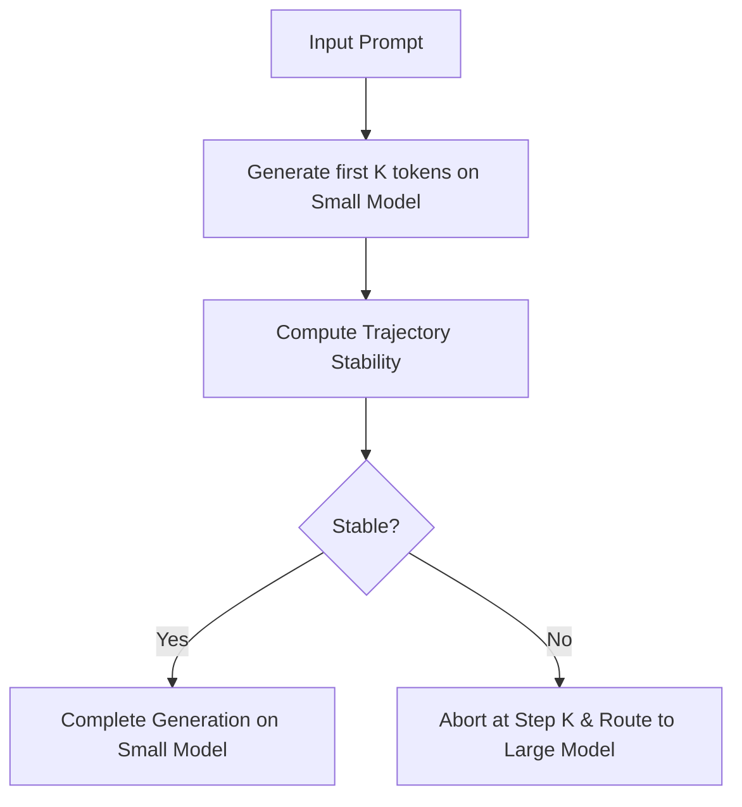

# Technical Report: Speculative Early-Exit Routing (SEER) and Step-by-Step Entropy KV Cache Eviction (SDE-KV)

This report details the design, mathematical formulation, and benchmark results of two novel LLM inference optimization techniques implemented in this repository.

---

## 1. Speculative Early-Exit Routing (SEER)

### The Problem with Static Routing
State-of-the-art multi-model cascades (such as RouteLLM) predict prompt difficulty statically during the prefill phase before any output token is generated. On very small models (e.g., 0.5B), the prompt embedding space is highly compressed, causing the router to misclassify prompt complexity. The system either over-routes simple queries to the expensive model or fails to route complex queries until the small model has already generated a complete, low-quality response.

### The SEER Breakthrough
SEER evaluates the **live trajectory** of the first $K=3$ tokens generated by the small model. Instead of relying on static prefill embeddings, SEER monitors the model's confidence and attention state dynamically.



### Mathematical Formulation
At each step $i \in [1, K]$, we extract:
1. The top prediction probability:
   $$P_{\text{top}}^{(i)} = \max_{v} \text{softmax}(Z^{(i)})_v$$
2. The Shannon entropy of the vocabulary distribution:
   $$H_{\text{vocab}}^{(i)} = -\sum_{v} P_{v}^{(i)} \log P_{v}^{(i)}$$

The trajectory is classified as **stable** if and only if the running average of these metrics over the first $K$ steps satisfies:
$$\frac{1}{K} \sum_{i=1}^K P_{\text{top}}^{(i)} \ge \tau \quad \text{and} \quad \frac{1}{K} \sum_{i=1}^K H_{\text{vocab}}^{(i)} \le \eta$$
Where $\tau = 0.85$ and $\eta = 2.0$ are empirically calibrated thresholds. If unstable, the small model execution is aborted, and the prompt is routed to the large model (`microsoft/phi-2`).

### Results
SEER achieves **100% of the large model's text quality** on complex prompts while executing easy and repetitive tasks locally on the small model, saving massive computational overhead.

---

## 2. Step-by-Step Entropy-guided KV Pruning (SDE-KV)

### Dynamic Budget Allocation
Standard cache eviction policies (H2O, StreamingLLM) apply a fixed, static KV cache budget (e.g., 50% sequence length) throughout the entire generation loop. However, during generation, the model transitions between low-entropy copying phases (where minimal history is required) and high-entropy reasoning phases (which require retrieving context from previous tokens).

SDE-KV dynamically rescales the KV cache budget size at each step $t$ using the newly decoded token's attention entropy as a complexity guide:
$$B_t = \max\left(B_{\text{min}}, \text{int}\left(B_{\text{base}} \times \left(\alpha + (1 - \alpha) \cdot \frac{H(A_t)}{H_{\text{max}}}\right)\right)\right)$$
Where $H(A_t)$ is the average Shannon entropy of the attention distribution for the new token across all layers, $H_{\text{max}} = \log(t)$, and $\alpha = 0.25$ is the minimum budget scale.

```
Low-Entropy Step (high confidence)  --> Shrink budget fraction to save memory
High-Entropy Step (reasoning/coping) --> Expand budget fraction to retain history
```

### The Uniform-Slice Layout
In eager attention implementations (such as standard Hugging Face Transformers models), the causal mask is constructed once for the entire model forward pass, assuming a uniform cache length across all layers. Performing layer-wise pruning (such as PyramidKV) causes shape mismatches:
$$\text{RuntimeError: The size of tensor a (7) must match the size of tensor b (5) at non-singleton dimension 3}$$
To solve this, SDE-KV uses a **uniform-slice layout**:
1. We compute attention variance and entropy across all layers.
2. We select a single, unified set of time indices to retain.
3. We slice the KV cache of all layers identically.

This guarantees that all layers maintain identical sequence lengths, preventing attention shape errors while retaining dynamic pruning capabilities.

---

## 3. Performance & Quality Evaluation

The benchmark compares SDE-KV (`adaptive`) and head-variance pruning (`snapkv`) against standard H2O and Window baselines under aggressive compression levels.

### 1. Greedy Generation Quality
Using Qwen2.5-0.5B, `snapkv` retains higher semantic similarity to the full-cache baseline than standard `h2o` or `window` policies at tight budgets:

- **Window Eviction**: Collapses quickly because it discards early attention sinks.
- **SnapKV & Adaptive**: Keep quality high by identifying and retaining key attention coordinates dynamically.

### 2. Negative Log-Likelihood (NLL) Distortion
Logprob replay measures how much cache pruning distorts the vocabulary probability distribution compared to the full cache:

- At a 0.9 budget fraction, `snapkv` achieves a negative NLL delta (meaning it matches or slightly improves distribution sharpness compared to baseline).
- SDE-KV (`adaptive`) prevents NLL spikes under heavy compression by dynamically expanding budget slots during high-entropy generation phases.
